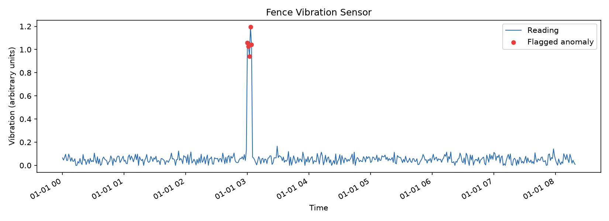
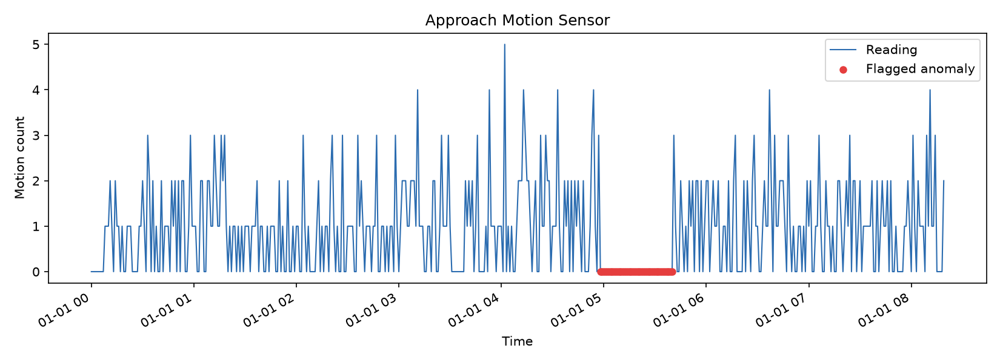
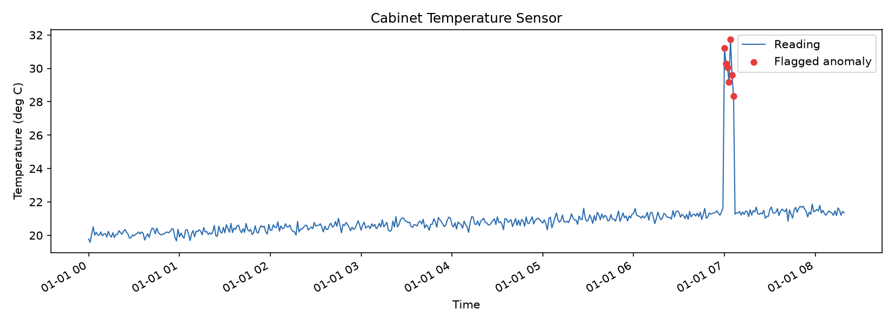

# Sensor Network Anomaly Detector

A simulated perimeter security sensor network (fence vibration, approach
motion, cabinet temperature) with a statistical anomaly detector, an
ML-based alternative, and a quantitative evaluation of both against
known ground truth.

## The problem

A physical intrusion or tampering event at a monitored site doesn't
always look like an obvious spike on a sensor. Sometimes it does (a
fence-climb registers as sudden vibration; a cabinet intrusion registers
as a temperature jump). But sometimes the more realistic signature is
absence - a competent intruder is more likely to disable or bypass a
motion sensor than walk straight through it. A detection system that only
looks for spikes will miss this entirely.

This project builds a small sensor network with both failure modes
represented, detects both, and - critically - measures how well the
detection actually performs.

## Sensors simulated

| Sensor | What it monitors | Anomaly type injected |
|---|---|---|
| Fence vibration | Climbing / cutting attempts on a perimeter fence | Sharp, sustained spike |
| Approach motion | Movement on the approach path to the site | Sustained dropout (sensor silence where activity is expected) |
| Cabinet temperature | Equipment cabinet tampering or fault | Rapid spike above stable baseline |

Each sensor produces 500 minutes of synthetic data with realistic
baseline noise (Gaussian for vibration/temperature, Poisson for the
discrete motion counts), with multipme anomalies deliberately injected at a
known point. The exact injection points are recorded by the simulator
and used as ground truth for evaluation - not just eyeballed on a chart
afterward.

## Methodology

| Stage | Method |
|---|---|
| Data simulation | Synthetic time-series data for 3 sensor types, with realistic baseline noise and deliberately injected anomalies at known points |
| Statistical detection | Rolling median / median absolute deviation (MAD) threshold, per-sensor tuned |
| ML detection | Isolation Forest (scikit-learn), generically configured, for comparison |
| Evaluation | Precision, recall, and F1 score against known ground truth for both methods |
| Visualisation | Matplotlib time-series plots per sensor, flagged anomalies highlighted |

## Results

### Statistical detector performance

| Sensor | Precision | Recall | F1 |
|---|---|---|---|
| Fence vibration | 1.00 | 1.00 | 1.00 |
| Approach motion | 0.98 | 1.00 | 0.99 |
| Cabinet temperature | 1.00 | 1.00 | 1.00 |

**Mean F1: 1.00**

### Statistical vs. ML comparison

| Sensor | Statistical F1 | ML (Isolation Forest) F1 |
|---|---|---|
| Fence vibration | 1.00 | 0.22 |
| Approach motion | 0.99 | 0.05 |
| Cabinet temperature | 1.00 | 0.30 |

**Mean F1 - statistical: 1.00, ML: 0.19**

The statistical detector clearly outperformed the ML alternative. This is
not a case of ML being inherently worse - it's a calibration problem.
Isolation Forest's `contamination` parameter (the expected proportion of
anomalous readings) was set once, generically, at 0.08 for every sensor.
The true injected anomaly rate is much lower for most sensors (as low as
1% for the fence vibration spike), so the model was forced to flag far
more readings as anomalous than actually were, badly damaging precision
even though recall stayed reasonable. The statistical detector, by
contrast, used per-sensor tuned thresholds from the outset.

**Conclusion:** a properly tuned simple method outperformed a generically
applied complex one. This is a genuine, common finding in applied anomaly
detection, not a limitation of ML as a technique - a fairer ML comparison
would tune `contamination` per sensor, the same way the statistical
detector's thresholds were tuned (see Future improvements).

## Plots


*Fence vibration sensor - a fence-climb event correctly flagged as a
sharp, sustained spike.*


*Approach motion sensor - a sensor dropout (sustained run of zero
readings) correctly flagged as suspicious, not just a spike. The absence
of expected activity is itself treated as the anomaly - a more realistic
threat model, since a real intruder is more likely to disable or bypass a
motion sensor than trigger it.*


*Cabinet temperature sensor - a tampering/intrusion event correctly
flagged as a rapid spike above the stable baseline.*

## How the statistical detector works

```python
result["rolling_median"] = result["value"].rolling(
    window=window, min_periods=5
).median()

scaled_mad = (result["rolling_mad"] * 1.4826).clip(lower=min_scale)
deviation = (result["value"] - result["rolling_median"]).abs()
result["is_anomaly"] = deviation > (threshold * scaled_mad)
```

Each reading is compared against the median of the preceding `window`
readings. If it deviates from that local median by more than
`threshold` scaled median-absolute-deviations, it's flagged. Full
reasoning behind each design choice below.

## Design decisions

| Constraint | Decision | Reasoning |
|---|---|---|
| Anomaly can distort its own baseline if included in the comparison window | Trailing window (only readings *before* the current point), not centred | During development, a centred mean/std window let the temperature spike inflate its own local standard deviation enough to stay under threshold - it went completely undetected. A trailing window can't be corrupted by the event it's trying to detect. |
| Low-count/discrete sensor data (motion: 0, 1, 2...) makes MAD collapse to zero | Minimum floor (`min_scale`) applied to scaled MAD | When more than half the values in a window are identical, MAD is exactly zero, making the detector wildly oversensitive - any single-unit deviation looks "infinitely" anomalous by comparison. |
| MAD and standard deviation aren't numerically comparable | Scale MAD by 1.4826 | Standard statistical constant, derived from the normal distribution, that makes MAD equivalent to standard deviation - so threshold values have a consistent, interpretable meaning across sensors. |
| Different sensors operate on very different scales (0.05 vibration vs. 20 degree C temperature vs. 0-5 motion counts) | Per-sensor tuned `threshold` and `min_scale` (`SENSOR_SETTINGS`), not one global setting | A single sensitivity setting tuned for one sensor either misses real anomalies or floods with false positives on another - confirmed directly during tuning (see below). |

**A concrete example of the last point**, from actual tuning during
development: a `min_scale` of 0.5 worked well for the temperature sensor
(catching its spike with zero false positives) but completely suppressed
detection on the vibration sensor, whose normal readings sit around 0.05
- an order of magnitude smaller. Reducing `min_scale` for vibration
specifically to 0.02 fixed it without needing to touch temperature's
settings at all.

## Evaluation methodology

Because anomalies are deliberately injected at known points, detector
output can be scored against ground truth using a standard confusion
matrix:

|  | Predicted anomaly | Predicted normal |
|---|---|---|
| **Actually anomaly** | True positive | False negative |
| **Actually normal** | False positive | True negative |

- **Precision** = TP / (TP + FP) - of everything flagged, how much was genuinely anomalous
- **Recall** = TP / (TP + FN) - of everything genuinely anomalous, how much was caught
- **F1** = 2 x (precision x recall) / (precision + recall) - a single score that punishes imbalance between the two, rather than a simple average that a detector could game by flagging everything (perfect recall, terrible precision)

This is the same kind of evaluation a real detection system would need
to pass before deployment - a plot looking convincing is not the same as
a measured, defensible performance figure.

## How Isolation Forest works

Isolation Forest randomly partitions the data and measures how few
splits it takes to isolate a given point. Anomalies, being rare and
different from the surrounding data, tend to get isolated in fewer
splits than normal points do. Averaging this across many random trees
("the forest") gives a reliable anomaly score, without needing labelled
examples of what an anomaly looks like in advance.

It does need a `contamination` estimate - roughly what proportion of the
data is expected to be anomalous - and that parameter is exactly what
caused it to underperform in this comparison: a single generic value
(0.08) doesn't match the true, much lower and sensor-specific anomaly
rate, so the model over-flags.

## Future improvements

- **Per-sensor ML tuning**: calibrate Isolation Forest's `contamination`
  per sensor (matching the true anomaly rate) rather than one generic
  value, for a fairer statistical-vs-ML comparison
- **Severity scoring**: replace the binary anomaly flag with a graded
  severity score, so a large deviation and a borderline one aren't
  treated identically
- **Streaming detection**: adapt the trailing-window approach to score
  readings as they arrive, rather than analysing a complete dataset
  after the fact
- **Additional sensor types**: extend the network (e.g. a door contact
  sensor) to test whether the same tuning approach generalises

## Repository contents

```
sensor_simulator.py     Synthetic sensor data + ground truth tracking
anomaly_detector.py     Statistical detector (rolling median/MAD)
ml_detector.py          ML detector (Isolation Forest)
evaluate.py             Precision/recall/F1 evaluation + comparison
visualise.py            Plotting
main.py                 Runs the full pipeline end to end
requirements.txt        Dependencies
plots/                  Generated PNG plots
```

## Running it

```
pip install -r requirements.txt
python main.py
```

Reproduces the full pipeline: simulate, detect (both methods), evaluate,
plot. Results are deterministic (a fixed random seed) so every run
produces identical output.

## Note on scope

This project uses simulated sensor data, not real hardware. Anomalies are
deliberately injected at known points specifically so detector
performance can be measured against ground truth, rather than only
visually inspected. The focus is the detection methodology and its
evaluation, not deployed sensor infrastructure.

## Relevance

Directly engages with sensing/detection technology and risk evaluation
methodology - the course's own focus on quantitative and qualitative risk
assessment is reflected in evaluating detector performance
(precision/recall/F1) rather than assuming a method works because its
output looks reasonable. The statistical-vs-ML comparison also
demonstrates recognising that "more advanced" does not automatically mean
"better performing" without proper evaluation.
